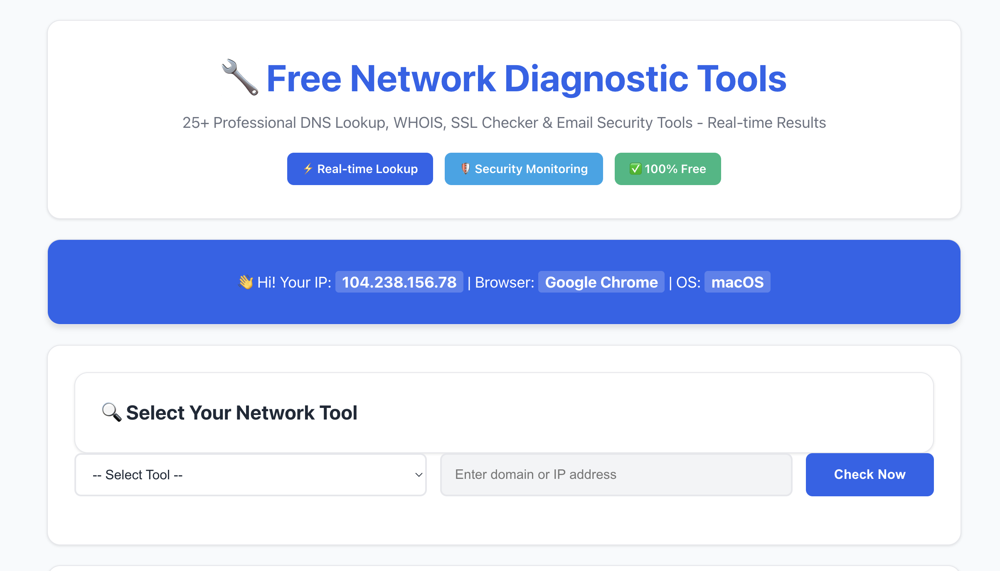

# 🌐 Network Tools - Free DNS & Network Diagnostic Tools


Koleksi lengkap tools diagnostik jaringan gratis yang menyediakan 25+ alat professional untuk analisis DNS, validasi keamanan email, pemeriksaan sertifikat SSL, dan monitoring kesehatan domain. Semua tools memberikan hasil real-time yang akurat.

## 🚀 Demo

**Live Demo:** [https://tools.jowhost.com](https://tools.jowhost.com)



## ✨ Fitur Utama

### 🔍 DNS Tools
- **DNS A Record** - Resolusi IPv4 address
- **DNS AAAA** - Resolusi IPv6 address
- **MX Record** - Mail exchange servers
- **NS Record** - Name servers
- **CNAME** - Canonical name records
- **TXT Record** - Text records
- **SOA Record** - Start of authority
- **SRV Record** - Service records
- **PTR Record** - Reverse DNS lookup
- **All DNS Records** - Comprehensive DNS analysis

### 📧 Email Security Tools
- **SPF Check** - Sender Policy Framework validation
- **DKIM Check** - DomainKeys Identified Mail verification
- **DMARC Check** - Domain-based Message Authentication
- **Email Blacklist Check** - Spam blacklist verification

### 🔒 SSL & Security Tools
- **SSL Certificate Info** - Certificate details and chain
- **SSL Expiry Check** - Certificate expiration monitoring

### 🌍 Domain & Network Tools
- **WHOIS Lookup** - Domain registration information
- **Domain Health Check** - Comprehensive domain analysis
- **Ping Test** - Network latency testing
- **Port Scanner** - Port connectivity checking
- **IP Information** - Geographic and ISP information

## 🛠️ Teknologi

- **Frontend:** HTML5, CSS3, JavaScript (ES6+)
- **Backend:** PHP 8.0+
- **API:** RESTful JSON API
- **PWA:** Progressive Web App support
- **SEO:** Fully optimized for search engines

## 📋 Persyaratan Sistem

- PHP 8.0 atau lebih tinggi
- Web server (Apache/Nginx)
- cURL extension (untuk beberapa tools)
- OpenSSL extension (untuk SSL tools)

## 🚀 Instalasi

### 1. Clone Repository

```bash
git clone https://github.com/fianbiasa/network-tools.git
cd network-tools
```

### 2. Setup Web Server

#### Apache
Pastikan `.htaccess` sudah aktif untuk URL rewriting.

#### Nginx
Tambahkan konfigurasi berikut:

```nginx
location / {
    try_files $uri $uri/ /index.php?$query_string;
}

location ~ \.php$ {
    fastcgi_pass unix:/var/run/php/php8.0-fpm.sock;
    fastcgi_index index.php;
    fastcgi_param SCRIPT_FILENAME $document_root$fastcgi_script_name;
    include fastcgi_params;
}
```

### 3. Konfigurasi PHP

Pastikan extension berikut aktif di `php.ini`:

```ini
extension=curl
extension=openssl
extension=json
```

### 4. Set Permissions

```bash
chmod 755 /path/to/project
chown -R www-data:www-data /path/to/project
```

## 📁 Struktur Project

```
network-tools/
├── index.php              # Halaman utama dengan UI
├── api.php                # Backend API endpoints
├── manifest.json          # PWA manifest
├── .htaccess              # Apache rewrite rules
├── robots.txt             # SEO robots file
├── sitemap.xml            # XML sitemap
├── favicon.ico            # Favicon
├── icon-92.png            # PWA icon
├── screenshot-desktop.png # Screenshot untuk dokumentasi
├── SEO-OPTIMIZATION.md    # Dokumentasi SEO
├── .gitignore             # Git ignore rules
└── README.md              # Dokumentasi project
```

## 🔧 API Endpoints

### Base URL
```
POST /api.php
```

### Parameters
- `action` (string): Tool yang akan digunakan
- `query` (string): Domain atau IP address yang akan diperiksa

### Contoh Request

```javascript
// DNS A Record Lookup
const response = await fetch('/api.php', {
    method: 'POST',
    headers: {
        'Content-Type': 'application/x-www-form-urlencoded',
    },
    body: new URLSearchParams({
        action: 'a',
        query: 'google.com'
    })
});

const result = await response.json();
```

### Response Format

```json
{
    "success": true,
    "data": [
        {
            "label": "A Record 1",
            "value": "142.250.191.78 (TTL: 300)"
        }
    ],
    "message": "",
    "title": "A Records for google.com"
}
```

### Available Actions

| Action | Description | Example Query |
|--------|-------------|---------------|
| `a` | DNS A Record | `google.com` |
| `aaaa` | DNS AAAA Record | `google.com` |
| `mx` | MX Record | `gmail.com` |
| `ns` | NS Record | `google.com` |
| `cname` | CNAME Record | `www.github.com` |
| `txt` | TXT Record | `google.com` |
| `soa` | SOA Record | `google.com` |
| `srv` | SRV Record | `_sip._tcp.google.com` |
| `ptr` | PTR Record | `8.8.8.8` |
| `all` | All DNS Records | `google.com` |
| `spf` | SPF Check | `gmail.com` |
| `dkim` | DKIM Check | `gmail.com` |
| `dmarc` | DMARC Check | `gmail.com` |
| `ssl` | SSL Certificate | `google.com` |
| `ssl-expiry` | SSL Expiry | `google.com` |
| `whois` | WHOIS Lookup | `google.com` |
| `domain-health` | Domain Health | `google.com` |
| `blacklist` | Blacklist Check | `example.com` |
| `ping` | Ping Test | `google.com` |
| `port` | Port Check | `google.com:80` |
| `ip-info` | IP Information | `8.8.8.8` |

## 🎨 Customization

### Mengubah Tema

Edit variabel CSS di `index.php`:

```css
:root {
    --color-primary: #2563eb;      /* Warna utama */
    --color-secondary: #1e40af;    /* Warna sekunder */
    --color-success: #10b981;      /* Warna sukses */
    --color-error: #ef4444;        /* Warna error */
    --color-background: #f8fafc;   /* Background */
}
```

### Menambah Tool Baru

1. Tambahkan option di select dropdown (`index.php`):
```html
<option value="new-tool">New Tool - Description</option>
```

2. Tambahkan case di `api.php`:
```php
case 'new-tool':
    // Implementation logic
    respond(true, $result, '', "New Tool Results");
    break;
```

## 🔒 Keamanan

- Input sanitization dan validation
- Rate limiting (dapat ditambahkan)
- CSRF protection (dapat ditambahkan)
- XSS protection
- SQL injection prevention (tidak menggunakan database)

## 📈 SEO & Performance

- ✅ Fully optimized meta tags
- ✅ Open Graph dan Twitter Card
- ✅ Schema.org structured data
- ✅ XML sitemap
- ✅ Robots.txt
- ✅ Progressive Web App (PWA)
- ✅ Mobile-first responsive design
- ✅ Fast loading dengan preconnect

## 🤝 Contributing

1. Fork repository
2. Buat feature branch (`git checkout -b feature/amazing-feature`)
3. Commit perubahan (`git commit -m 'Add amazing feature'`)
4. Push ke branch (`git push origin feature/amazing-feature`)
5. Buat Pull Request

### Development Guidelines

- Gunakan PHP PSR-12 coding standards
- Tambahkan comments untuk logic yang kompleks
- Test semua tools sebelum commit
- Update dokumentasi jika menambah fitur baru

## 🐛 Bug Reports

Laporkan bug melalui [GitHub Issues](https://github.com/fianbiasa/network-tools/issues) dengan informasi:

- Deskripsi bug
- Steps to reproduce
- Expected vs actual behavior
- Browser dan OS information
- Screenshots (jika diperlukan)

## 📝 Changelog

### v1.0.0 (2025-11-10)
- ✅ Initial release
- ✅ 25+ network diagnostic tools
- ✅ PWA support
- ✅ Mobile-responsive design
- ✅ SEO optimization

## 📄 License

Project ini menggunakan [MIT License](LICENSE). Lihat file LICENSE untuk detail lengkap.

## 👨‍💻 Author

**Zulfianto**
- GitHub: [@fianbiasa](https://github.com/fianbiasa)
- Website: [JowHost](https://jowhost.com)

## 🙏 Acknowledgments

- Terima kasih kepada komunitas open source
- DNS lookup menggunakan PHP native functions
- SSL check menggunakan OpenSSL
- Icons dari emoji unicode

## 📞 Support

Jika Anda membutuhkan bantuan:

1. Baca dokumentasi ini terlebih dahulu
2. Cek [Issues](https://github.com/fianbiasa/network-tools/issues) yang sudah ada
3. Buat issue baru jika belum ada
4. Atau kontak melalui website [JowHost](https://jowhost.com)

---

⭐ **Jika project ini membantu Anda, berikan star di GitHub!**


